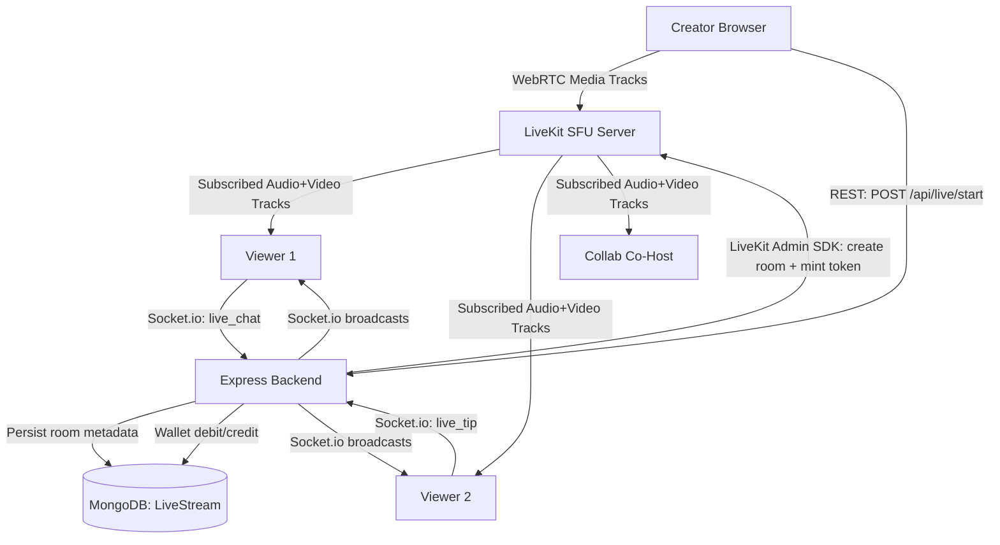

# Toka Live Streaming Feature — Roadmap

## Overview

This document outlines the full design, architecture, and phased implementation plan for the
Toka Live Streaming feature. It covers the backend signaling and media relay, frontend room
experience, real-time interactivity (chat, tipping, co-hosting), pay-to-private access control,
and client-side stream replay.

---

## Architecture



### Technology Stack

| Layer | Technology | Purpose |
|---|---|---|
| Media Relay | **LiveKit** (Self-Hosted, Docker) | SFU — routes all audio/video tracks to subscribers |
| Real-Time Events | **Socket.io** (added to Express HTTP server) | Chat messages, viewer count deltas, tip events, co-host invites |
| Stream Metadata | **MongoDB** (LiveStream model) | Room state, access control, participant lists |
| Replay | **Browser MediaRecorder API** | Client-side MP4 recording — creator downloads locally, zero server storage |
| Frontend SDK | **@livekit/components-react** | LiveKitRoom, VideoConference, useTracks hooks |
| Wallet Payments | **Existing Transaction model** | live_tip and live_entry transaction types |

---

## Local Development Setup

Before starting the backend and frontend dev servers, run the LiveKit SFU container:

```bash
docker run --rm -p 7880:7880 -p 7881:7881 -p 7882:7882/udp \
  livekit/livekit-server --dev
```

- Port 7880: HTTP/WebSocket API
- Port 7881: RTCP/TCP
- Port 7882/udp: WebRTC media

In --dev mode, LiveKit generates tokens automatically — no API keys required locally.

Add to backend .env:
```env
LIVEKIT_HOST=ws://localhost:7880
LIVEKIT_API_KEY=devkey
LIVEKIT_API_SECRET=secret
```

Add to frontend .env.local:
```env
NEXT_PUBLIC_LIVEKIT_URL=ws://localhost:7880
```

---

## Feature Scope

### Discovery
- **Live Tab** in the Video Feed alongside For You and Following
- Grid of active LiveStreamCard components with real viewer counts
- Pulsing red LIVE badge, creator avatar, stream title, privacy lock icon

### Stream Modes
- **1-to-Many Public**: Creator broadcasts, unlimited viewers join for free
- **1-to-Many Private**: Creator sets a paywall mode
- **Collab (Multi-Host)**: Creator invites co-hosts who publish their own audio/video tracks into the same LiveKit room

### Interactive Features

| Feature | Description |
|---|---|
| Live Chat | Real-time floating overlay via Socket.io |
| Live Tipping | Viewer deducts ZAR, credits host wallet instantly. Animated golden toast in chat. |
| Viewer Count | Real-time participant count via Socket.io viewer_count events |
| Live Duration Timer | Elapsed timer shown in stream room HUD |
| Co-Host Invite | Host searches for a user by username and sends a collab invite |
| Pay-to-Private | Viewer unlocks a private room by paying ZAR |

### Pay-to-Private Modes

Creator chooses one of three private access modes at stream setup:

| Mode | Description |
|---|---|
| **Entry Fee** | Viewer pays a one-time ZAR amount to enter the room |
| **Subscription** | Viewer pays a recurring monthly ZAR subscription |
| **Tip Invite** | Viewer tips a minimum ZAR amount and is granted room access |

### Stream Replay
- Creator stream recorded client-side via MediaRecorder API
- On stream end, chunks assembled into a Blob
- Programmatic download triggers: toka-stream-replay.mp4
- Zero server storage required

---

## Phased Implementation Plan

### Phase 1 — Backend Infrastructure

- [ ] Install socket.io and livekit-server-sdk in backend
- [ ] Refactor index.js to use http.createServer(app) + attach socket.io Server
- [ ] Create LiveStream.js Mongoose model
- [ ] Extend Transaction.js with live_tip and live_entry types + liveStreamId field
- [ ] Create liveController.js with all route handler functions
- [ ] Create liveRoutes.js and mount under /api
- [ ] Implement Socket.io connection handler

REST Endpoints:

| Method | Path | Auth | Description |
|---|---|---|---|
| POST | /api/live/start | Yes | Create LiveKit room, mint host token, create DB record |
| GET | /api/live/active | No | Fetch all live streams for Live tab |
| GET | /api/live/:roomId | No | Fetch single room metadata |
| POST | /api/live/:roomId/join | Yes | Validate access, mint viewer token |
| POST | /api/live/:roomId/tip | Yes | Debit viewer, credit host, broadcast tip event |
| POST | /api/live/:roomId/invite-cohost | Yes | Host invites user to co-host |
| POST | /api/live/:roomId/cohost | Yes | Accept co-host invite, mint co-host token |
| POST | /api/live/:roomId/unlock-private | Yes | Process paywall |
| POST | /api/live/:roomId/end | Yes | Mark stream ended, delete LiveKit room |

### Phase 2 — Frontend Store and Routing

- [ ] Install socket.io-client, @livekit/components-react, @livekit/components-core, livekit-client
- [ ] Create useLiveStore.ts (Zustand)
- [ ] Create app/live/page.tsx — Live tab listing page
- [ ] Create app/live/[roomId]/page.tsx — Stream room page

### Phase 3 — Stream Room Experience

- [ ] Build StreamRoom.tsx with LiveKit integration
  - Mobile: full-screen 9:16 portrait, floating chat at bottom
  - Desktop: split layout (70/30) — video left, chat + participant list right
- [ ] Integrate VideoConference or custom useTracks for multi-host tile grid
- [ ] Build MediaRecorderManager.tsx — records creator stream, triggers MP4 download on end
- [ ] Add live duration timer and viewer count HUD overlay

### Phase 4 — Interactive Features

- [ ] Build LiveChat.tsx — Socket.io-powered floating chat with auto-scroll and tip toasts
- [ ] Build LiveTipButton.tsx — pre-set amount picker (R5 / R10 / R25 / custom)
- [ ] Build CohostInvitePanel.tsx — username search + invite button
- [ ] Build co-host accept modal for recipient

### Phase 5 — Pay-to-Private

- [ ] Build GoLiveOverlay.tsx — slides up from feed bottom, includes privacy picker
- [ ] Build PrivateRoomModal.tsx — viewer sees unlock options and can pay
- [ ] Connect /api/live/:roomId/unlock-private to wallet debit flow
- [ ] Emit room_unlocked Socket.io event to grant access

### Phase 6 — Live Discovery Tab

- [ ] Build LiveStreamCard.tsx
- [ ] Integrate Live tab into VideoFeed.tsx
- [ ] Wire data to GET /api/live/active polling every 15 seconds

### Phase 7 — Sidebar Integration

- [ ] Add Go Live button in DesktopSidebar.tsx for authenticated creators
- [ ] Trigger GoLiveOverlay from sidebar

### Phase 8 — Verification and Polish

- [ ] npm run lint and npm run build (0 errors)
- [ ] Manual end-to-end test covering all flows
- [ ] Commit and push to main

---

## MongoDB: LiveStream Model

```js
{
  hostId: ObjectId,
  title: String,
  status: 'live' | 'ended',
  privacy: 'public' | 'private',
  privateMode: 'entry_fee' | 'subscription' | 'tip_invite',
  entryFeeZAR: Number,
  subscriberPriceZAR: Number,
  tipInviteMinZAR: Number,
  participants: [ObjectId],
  cohosts: [ObjectId],
  unlockedViewers: [ObjectId],
  viewerCount: Number,
  livekitRoomName: String,
  startedAt: Date,
  endedAt: Date,
}
```

---

## Frontend Component Map

```
frontend/src/
+-- app/
¦   +-- live/
¦       +-- page.tsx
¦       +-- [roomId]/
¦           +-- page.tsx
+-- components/
¦   +-- live/
¦       +-- GoLiveOverlay.tsx
¦       +-- StreamRoom.tsx
¦       +-- LiveChat.tsx
¦       +-- LiveTipButton.tsx
¦       +-- CohostInvitePanel.tsx
¦       +-- PrivateRoomModal.tsx
¦       +-- LiveStreamCard.tsx
¦       +-- MediaRecorderManager.tsx
+-- store/
    +-- useLiveStore.ts
```

---

## Dependencies

Backend:
```bash
npm install socket.io livekit-server-sdk
```

Frontend:
```bash
npm install socket.io-client @livekit/components-react @livekit/components-core livekit-client
```
