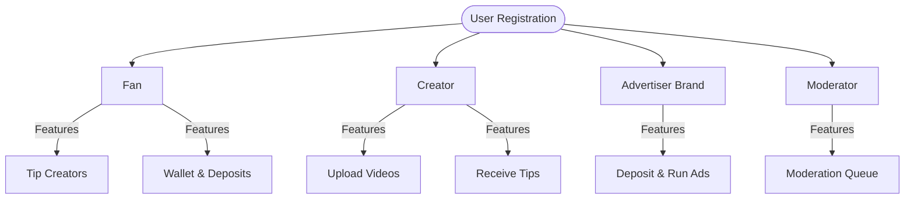

# User Roles & Permissions - Toka Platform

This document describes the role-based access control (RBAC) design, features, permissions, and database definitions for each of the user roles supported on the Toka platform.

---

## Roles Overview

Toka supports four distinct user roles, each tailored to different participants in the creator economy ecosystem:



---

## 1. Fan (`fan`)

### Core Purpose
Fans are the consumers of the platform. They view content, support creators through tips, and manage a digital wallet to facilitate transactions.

### Core Features & Permissions
* **Feed Interaction**: View the public video feed, double-tap to like videos, and check profiles.
* **Wallet & Payments**: Deposit ZAR into their wallet using the Paystack checkout flow.
* **Tipping**: Transfer ZAR balances directly to creators as tips/donations.
* **Inbox Notifications**: Receive push and in-app notifications for activities.

---

## 2. Creator (`creator`)

### Core Purpose
Creators are the content engine of Toka. They upload short-form videos and build fan support to earn directly from their content.

### Core Features & Permissions
* **Video Uploading**: Access the client-side compression pipeline and upload video assets (`.mp4`) to the platform.
* **Monetization**: Earn ZAR tips transferred by fans directly into their wallet.
* **Content Tiers**: Flag uploads under different tiers (e.g. `brand_safe` or `fan_funded`).
* **Followers**: Build a follower base (other users can follow/unfollow creators).

---

## 3. Brand (`brand`)

### Core Purpose
Brands are advertisers who deposit funds to promote products and run marketing campaigns on the platform.

### Core Features & Permissions
* **Deposits**: Deposit large ZAR budgets via the Paystack gateway integration.
* **Advertising**: Create and manage sponsored campaign content.
* **Permissions Scope**: Identical to fans in terms of feed viewing, but gains access to business/advertiser services.

---

## 4. Moderator (`moderator`)

### Core Purpose
Moderators are platform administrators responsible for content vetting, security, and ensuring community guidelines are maintained.

### Core Features & Permissions
* **Moderation Workspace**: Access the `/moderation` portal queue.
* **Vetting Actions**: Review flagged videos awaiting human vetting and mark them as `approved` or `rejected`.
* **Platform Security**: Defer content safety processing or override automated safety tags.

---

## Database Schema & Integration

Roles are enforced via the Mongoose `User` model using a string enum:

```javascript
role: {
  type: String,
  enum: ['fan', 'creator', 'brand', 'moderator'],
  default: 'fan',
  required: true
}
```

### Access Guard (Middleware Example)
Protected endpoints in the Express backend restrict access using the `protect` and role-specific auth middlewares:

```javascript
// Example: Requiring Moderator role to access vetting controls
import { protect, requireRole } from '../middlewares/auth.js';

router.patch(
  '/videos/:id/vetting-status', 
  protect, 
  requireRole('moderator'), 
  updateVettingStatus
);
```
